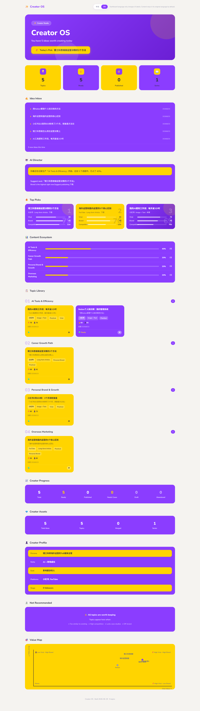

# Creator OS

**把灵感变成作品。**

[English](README.md) | [中文](README.zh-CN.md)

Creator OS 是一个 AI 驱动的创作者内容管理系统。你只需要记录灵感，AI 会自动帮你整理、分类、去重、评分，并生成内容看板。

---

## 🚀 快速开始（新用户必读）

### 30 秒上手

1. **克隆项目** → 在你的 AI 助手中说：`Clone https://github.com/xiaxia94/creator-os 然后按照 AGENTS.md 的说明帮我管理内容选题`
2. **告诉 AI 你是谁** → 说"我是 AI 职场成长类创作者，主做小红书和 YouTube"
3. **粘贴灵感** → 直接粘贴你的想法，AI 自动处理
4. **查看看板** → 打开 `preview.html` 查看可视化结果

**就这么简单！** 详细说明请查看 [USER_GUIDE.md](USER_GUIDE.md)

---

## 什么是 Creator OS？

Creator OS 是一个 **AI 内容助手**，它能帮你：

- 📥 **收集灵感** — 随时记录想法，不用考虑格式
- 🤖 **智能分析** — AI 自动拆分、分类、去重
- 📊 **四维评分** — 爆款指数、人设价值、商业价值、竞争度
- 📋 **内容看板** — 可视化展示所有选题和进度
- 🎯 **发布建议** — AI 推荐下一篇最值得发布的内容

---

## 适合谁用？

- **内容创作者** — 想系统化管理灵感和选题
- **多平台创作者** — 同时运营 X/Twitter、YouTube、小红书、B站等
- **个人 IP 打造者** — 想用数据驱动内容决策
- **AI 工具爱好者** — 想用 AI 提升创作效率

---

## 安装方式

所有方式都只需要 **clone 仓库**，无需额外下载或配置。

### 方式一：通用方式（推荐）

在任何 AI 助手中输入：

```
Clone https://github.com/xiaxia94/creator-os 然后按照 AGENTS.md 的说明帮我管理内容选题
```

AI 会自动加载 `AGENTS.md`，直接开始工作。适用于 Claude Code、Codex、Cursor 等所有支持 Agent 的工具。

### 方式二：Claude Code

在 Claude Code 中输入：

```
Clone https://github.com/xiaxia94/creator-os 然后帮我处理灵感：...
```

Claude Code 会自动加载 `CLAUDE.md`，直接开始工作。

### 方式三：Codex

在 Codex 中输入：

```
Clone https://github.com/xiaxia94/creator-os
```

然后说 `/creator-os` 或"用 Creator OS"。Codex 会自动发现并加载内置 Skill。

### 方式四：Cursor

在 Cursor 中输入：

```
Clone https://github.com/xiaxia94/creator-os
```

Cursor 会自动加载 `.cursorrules`，直接开始工作。

---

## 快速开始

### 第一次使用（只需一次）

告诉 Creator OS 你是谁：

```
我是一个 AI 创作者。
主平台是小红书和 YouTube。
目标是建立个人影响力。
```

Creator OS 会自动记住你的信息，以后不用重复。

### 日常使用

直接把灵感发给 AI 即可：

```
AI 周报从 2 小时缩短到 15 分钟。
海外客户开会最容易踩的坑。
为什么很多人学 AI 坚持不下去。
```

或者粘贴整段备忘录：

```
今天想到：
* AI 周报自动化
* 海外客户开会踩坑
* AI 学习坚持不下去的原因
```

### AI 会自动完成

✓ 拆分灵感为独立选题

✓ 分类整理到不同主题

✓ 识别重复内容并合并

✓ 四维评分（爆款/人设/商业/竞争）

✓ 识别内容系列

✓ 推荐下一篇最值得发布的内容

✓ 生成内容看板

### 你会得到

✓ 自动整理后的选题库

✓ 内容生态分析

✓ 内容系列建议

✓ 创作进度统计

✓ AI 内容总监建议

✓ 最值得发布的选题推荐

✓ 可视化内容看板

---

## 完整示例

### 场景：第一次使用

**你输入：**
```
我是一个 AI 创作者，主平台是小红书和 YouTube，目标是建立个人影响力。

今天想到：
* AI 周报自动化能节省 2 小时
* 海外客户开会要确认时区
* 为什么很多人学 AI 坚持不下去
```

**AI 回复：**
```
✅ 已为你创建创作者画像！

📥 本次处理 3 个选题：

1. 「AI 周报自动化：从 2 小时到 15 分钟」
   爆款 75 / 人设 65 / 商业 70 / 竞争 50
   推荐：本周发布

2. 「海外客户开会的 5 个坑」
   爆款 60 / 人设 80 / 商业 55 / 竞争 40
   推荐：下周发布

3. 「为什么 90% 的人学 AI 坚持不下去」
   爆款 80 / 人设 75 / 商业 50 / 竞争 60
   推荐：随时可发

🔥 最值得发：「AI 周报自动化」
理由：实用价值高，能真正节省创作者时间

📊 看板已更新：~/.media-topic-skill/preview.html
```

### 场景：日常使用

**你输入：**
```
今天想到：
* 为什么学 AI 的人坚持不下去
* 理工科转运营的真实经历
```

**AI 回复：**
```
✅ 处理完成！

📥 新增 2 个选题：

1. 「为什么 90% 的人学 AI 坚持不下去」
   爆款 80 / 人设 75 / 商业 50 / 竞争 60
   推荐：本周发布

2. 「理工科转运营 3 年：踩过的坑和收获」
   爆款 65 / 人设 85 / 商业 55 / 竞争 35
   推荐：下周发布

🔗 合并 1 个重复选题：
- 「AI 学习方法」合并到 #1

🔥 最值得发：「为什么 90% 的人学 AI 坚持不下去」
理由：情绪触发强，容易引发共鸣

📊 看板已更新
```

---

## 看板功能

Creator OS 会生成一个可视化内容看板，包含：

| 板块 | 功能 |
|------|------|
| ✍️ 灵感收件箱 | 最近录入的灵感 |
| 🆕 本次更新 | 本次新增的选题统计 |
| 🤖 AI 内容总监 | AI 的内容策略建议 |
| 🔥 近期最值得发 | 按综合分排序的 Top 3 选题 |
| 📊 内容生态分析 | 主题分布和平衡性分析 |
| 📋 选题库 | 所有选题，按主题分组 |
| 📚 内容系列 | 自动识别的内容系列 |
| 📈 创作进度 | 创作统计和里程碑 |
| 💎 创作资产 | 累计灵感、选题、合并数 |
| 👤 创作者画像 | 你的创作者信息 |
| 🪦 暂不推荐 | 低分或不适合的选题 |
| 🎯 选题价值地图 | 选题的可视化分布 |

---

## 截图



*完整看板：灵感收件箱、AI 内容总监、近期最值得发、内容生态分析、选题库、内容系列、创作进度、选题价值地图。*

---

## 支持的语言

- **界面语言**：中文 / English
- **内容语言**：保留原文（默认）

你可以在看板中切换界面语言，但内容会保留你输入时的原始语言。

---

## 数据位置

Creator OS 自动检测可写位置保存数据：

```
~/.media-topic-skill/  或  <项目>/data/
├── topics.json      # 选题数据库
├── config.json      # 你的配置和画像
├── inbox-log.md     # 输入历史
└── preview.html     # 生成的看板
```

**备份建议：** 定期备份数据文件夹

---

## 项目结构

```
creator-os/
├── AGENTS.md                 # 通用入口，所有 AI 工具自动加载
├── CLAUDE.md                 # Claude Code 专用
├── .cursorrules              # Cursor 自动加载
├── .codex/skills/            # Codex 原生 Skill（自动发现）
│   └── creator-os/SKILL.md
├── core/
│   ├── topic.js              # 核心引擎
│   ├── prompts/              # AI 提示词模板
│   └── config/               # 配置文件
│
├── adapters/                 # 各平台适配器（备选）
│   ├── claude-code/SKILL.md
│   ├── cursor/.cursorrules
│   └── generic/AGENT.md
│
├── examples/                 # 示例文件
├── screenshots/              # 截图
├── skill.md                  # Skill 文档
├── README.md                 # 英文文档
├── README.zh-CN.md           # 本文件
├── LICENSE                   # MIT 许可证
└── .gitignore
```

---

## 常见问题

### Q: 我需要会编程吗？

**不需要。** Creator OS 是为普通创作者设计的。你只需要：
1. 安装一个 AI 助手（如 Claude Code）
2. 下载项目
3. 开始使用

### Q: 我的数据安全吗？

**完全安全。** 所有数据都保存在你的电脑上，不会上传到任何服务器。

### Q: 支持哪些平台？

支持所有主流内容平台：小红书、YouTube、B站、抖音、微信公众号、知乎、X/Twitter 等。

### Q: 可以多人协作吗？

目前只支持单人使用。未来可能会添加团队协作功能。

### Q: 如何更新到新版本？

在项目目录中运行 `git pull` 即可。你的数据不会丢失。

---

## 许可证

MIT License — 详见 [LICENSE](LICENSE)

Copyright (c) 2026 Creator OS

---

## 反馈与支持

- **问题反馈**：GitHub Issues
- **功能建议**：GitHub Discussions
- **使用交流**：待创建社区
